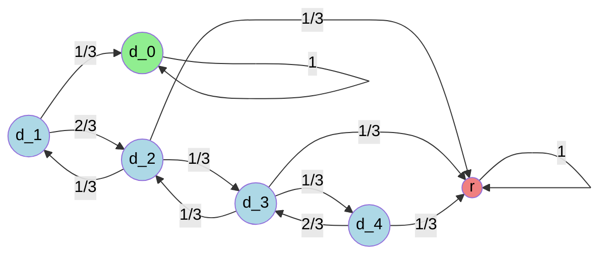

# [Puzzle](https://www.janestreet.com/puzzles/andys-afternoon-amble-index/)

<div class="col-12 mx-auto">
    
</div>

Andy the ant has moved on from his classic ‘Telstar’ [soccer ball](https://www.janestreet.com/puzzles/andys-morning-stroll-index/) homeland to live on a simpler spherical surface consisting of four white hexagons that are surrounded by alternating black triangles and white hexagons (three of each), and four black triangles surrounded by three white hexagons. To us this land is a truncated tetrahedron blown up into a sphere we see above on the left. Due to Andy’s tiny size and terrible eyesight, he doesn’t notice the curvature of the land and avoids the black triangles because he suspects they may be bottomless pits.

Much like his morning routine, every afternoon he wakes up from his nap on a white hexagon, leaves some pheromones to mark it as his special *home* space, and starts his random amble. Every step on this walk takes him to one of the three neighboring white hexagons with equal probability. He ends his amble as soon as he first returns to his home space, which he recognizes but cannot distinguish the edges of (i.e. he doesn’t know if he returned across the same edge as he left). As an example, on exactly 1/3 of afternoons Andy’s amble is 2 steps long, as he randomly visits one of the three neighbors, and then has a 1/3 probability of returning immediately to the home hexagon.

This afternoon his truncated tetrahedral homeland bounced through the very same kitchen with an infinite regular hexagonal floor tiling consisting of black and white hexagons, shown above on the right. In this tiling every white hexagon is surrounded by alternating black and white hexagons, and black hexagons are surrounded by six white hexagons. Andy fell off the ball and woke up on a white hexagon. He didn’t notice any change in his surroundings, and goes about his normal amble.

Throughout his walk, Andy remembers the turns he’s taken. Let $p$ be the probability that by the end of his afternoon amble on this new land he has discovered that he is no longer on the truncated tetrahedral sphere. Find $p$ in exact terms.

# Solution

In order to effectively describe both Andy's spherical truncated tetrahedron and kitchen floor, we use graphs: the ball can be reduced to the tetrahedral graph $K_4$, while the floor corresponds to the infinite hexagonal lattice graph $H$.
However, while $H$ is theoretically infinite, only a finite subset is actually reachable before Andy realizes something's up.
In practice, after fixing his first move on account of symmetry, the floor can be reduced to the home vertex, six "safe" vertices, and five "unsafe" vertices.[^1]
This would be enough to model a markov chain, but symmetry can allows further simplification.

<div class="col-9 mx-auto">
    
</div>
<div class="caption">
    Figure 1: The minimal subset of $H$.
</div>

Since all of the "unsafe" vertices result in Andy being red-pilled, they can be treated together as $r$.
Similarly, the "safe" vertices can be grouped by their distance from the home vertex, which itself would have a distance of zero.
Now, we can model the process as an absorbing Markov chain.
For simplicity, we treat both $r$ and $d_0$ as absorbing states and start the walk at $d_1$.



Let the transient-to-transient matrix for $d_1, \dots, d_4$ be $Q$. 
Using the absorbing state order $r, d_0$, let the transient-to-absorbing matrix be $R$.

$$
\begin{align}
    Q &= \begin{bmatrix}
        0 & \frac 2 3 & 0 & 0 \\
        \frac 1 3 & 0 & \frac 1 3 & 0 \\
        0 & \frac 1 3 & 0 & \frac 1 3 \\
        0 & 0 & \frac 2 3 & 0
    \end{bmatrix} \\
    R &= \begin{bmatrix}
        0 & \frac 1 3 \\
        \frac 1 3 & 0 \\
        \frac 1 3 & 0 \\
        \frac 1 3 & 0
    \end{bmatrix}
\end{align}
$$

Since Andy effectively begins his amble at $d_1$, the initial probability vector is $x_0 = \begin{bmatrix} 1 & 0 & 0 & 0\end{bmatrix}$, with $x_n = x_0 Q^{n}$.
The probability of being absorbed on the next step is $x_n R$. 
Therefore, the probability of eventual absorption is the series

$$
\begin{align}
    [P_{d_1 \rightarrow r}, P_{d_1 \rightarrow d_0}] &= \sum_{n=0}^{\infty} x_0 Q^{n} R \\
    &= x_0 (I - Q)^{-1} R \\
    &= \begin{bmatrix} \frac{11}{20} & \frac{9}{20}\end{bmatrix}
\end{align}
$$

which can easily be computed, for example, by the following Julia code.

```julia
using LinearAlgebra

Q = [0 2//3 0 0; 1//3 0 1//3 0; 0 1//3 0 1//3; 0 0 2//3 0]
R = [0 1//3; 1//3 0; 1//3 0; 1//3 0]
x_0 = [1 0 0 0]

display(x_0*inv(I-Q)*R)
```

Overall, I thought this was a fun puzzle, and I enjoyed the opportunity to use some tools from absorbing Markov chains that I had only recently learned!

[^1]: I may or may not have literally [printed](https://mathworld.wolfram.com/pdf/TruncatedTetrahedron.pdf) a truncated tetrahedron to double check.